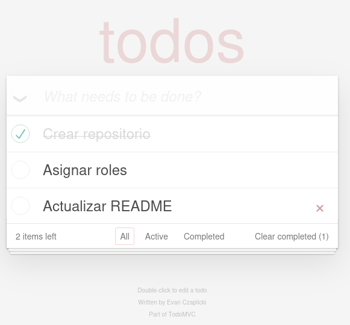

# Curso 23/24. Práctica 3. Interfaces gráficas para aplicaciones web

## Welcome :wave:

- **Who is this for**: Grupos de prácticas de la asignatura _IPM_.

- **What you'll learn**: Implementación de interfaces gráficas usando
  lenguajes propios de la Web. Diseño mobile-first, adaptativo y
  accesible.

- **What you'll build**: Construiréis una interfaz para aplicaciones
  web.

- **Prerequisites**: Asumimos que os resultan familiares el
  funcionamiento de una aplicación web y las herramientas básicas para
  desarrolladores web.

- **How long**: Este assigment está formado por tres pasos o
  _tareas_. La duración estimada de cada tarea es de una semana
  lectiva.

La práctica se divide en tres ejercicios relacionados con una
aplicación clásica, la lista de tareas o _TODO App_.

  - Esta aplicación es un ejemplo clásico en el que la usuaria maneja
    una _lista de tareas_ con las típicas operaciones CRUD: añadir,
    ver, editar, borrar.
	
    La aplicación se ha usado como ejemplo multitud de documentaciones
	y tutoriales y también como base para la [comparación de distintos
	_frameworks_](https://todomvc.com/).
	
  - Los casos de uso varían ligeramente de un ejemplo a otro. En esta
    práctica vamos a considerar exclusivamente los siguientes:
	
	- Añadir una tarea nueva.
	
	- Marcar todas las tareas como completadas.
	
	- Ver todas las tareas.
	
	- Ver las tareas completadas.
	
	- Ver las tareas _activas_, i.e. sin completar.
	
	- Ver el número de tareas _activas_.
	
	- Borrar las tareas completadas.
	
	- Marcar una tarea como completada.
	
	- Editar la descripción de una tarea.
	
	- Borrar una tarea.
	
  - En algunos ejemplos la lista de casos de uso difiere ligeramente
    de la lista del punto anterior. Por ejemplo podemos encontrar a
    mayores un caso de uso "Ordenar por fecha límite". En esta
    práctica dichas diferencias las ignoramos y únicamente tendremos
    en cuenta la lista del punto anterior.

<h2>Ejercicio 1: Implementar la interfaz</h2>

En este ejercicio implementaras la parte correspondiente a la
interfaz. No debes implementar ningún tipo de funcionalidad de la
aplicación.

### :wrench: Esta tarea tiene las siguientes partes:

  1. Selecciona un diseño de la interfaz distinto al empleado en el
     proyecto [TodoMVC](https://todomvc.com).
	 
	 

     En la web podemos encontrar multitud de ejemplos de diseño para
     una aplicación TODO, por ejemplo [60 Excellent To Do List App UI
     Designs](https://bashooka.com/inspiration/to-do-list-app-ui-designs/).
	 
  2. Ajusta el diseño a la lista de casos de uso planteada en la
     descripción.

     El diseño tiene que estar dirigido a dispositivos móviles, en
     concreto a _smartphones_.
	 
	 Añade al repositorio un fichero _PDF_ con el nombre
     `diseño-iu.pdf` donde se muestre el diseño que vas a implementar.

  3. Implementa el diseño empleando los lenguajes _html5_ y _css3_
     siguiendo las pautas del W3C:
	 
       - Usa html semántico.
	 
       - Separa el contenido (html5) de la presentación (css3).
	 
	   - La implementación debe seguir las normas de accesibilidad [WCAG
         2](https://www.w3.org/WAI/standards-guidelines/wcag/).

     Y estas otras pautas:
	 
	   - No uses ninguna librería o framework CSS.
	   

### :books: Objetivos de aprendizaje:

  - Diseño _mobile-first_.
  
  - Uso de estándares web.
  
  - HTML semántico.
  
  - Accesibilidad web.
  

<h2>Ejercicio 2: Diseño adaptativo</h2>

Para este ejercicio tienes que comprobar que todas las características
de los lenguajes html5 y css3 que empleas están disponibles en, al
menos, tres navegadores en versiones anteriores al comienzo del curso
académico actual.

### :wrench: Esta tarea tiene las siguientes partes:

  1. Extiende el diseño de la interfaz de manera que pueda mejorar
     paulatinamente a medida que lo hace la configuración del
     navegador web.
	 
	 Considera, al menos, los casos base típicos: _smartphone_,
     _tablet_, _desktop_.
	 
  2. Modifica la implementación del ejercicio anterior de manera que
     la interfaz adapte el diseño a la configuración del navegador.
	 
	 La implementación debe seguir las mismas pautas del ejercicio
     anterior.
	 
	 
### :books: Objetivos de aprendizaje:

  - _Responsive design_.
  
  - Compatibilidad _cross-browser_.
  

<h2>Ejercicio 3: WAI-ARIA</h2>

### :wrench: Esta tarea tiene las siguientes partes:

  1. Modifica la implementación del ejercicio anterior para que se
     ajuste a las normas de accesibilidad en aplicaciones Web
     [WAI-ARIA](https://www.w3.org/WAI/standards-guidelines/aria/).
	 
	 Para determinar las necesidades de la implementación ten en
     cuenta la lista de casos de uso. Aunque no hayas implementado
     ninguna funcionalidad estudia las actualizaciones y cambios de
     estado por los que transiciona la interfaz y aplica las reglas
     del WAI-ARIA pertinentes.
	 
  2. Implementa uno o dos casos de uso que demuestren la validez de lo
     realizado en el punto anterior.
	 
	 Para este paso no puedes utilizar ninguna librería de javascript,
     sólo _vanilla javascript_.
	 
	 
### :books: Objetivos de aprendizaje:

  - Accesibilidad en aplicaciones web.
  
  - Javascript.

<h2>Finish</h2>

_Congratulations friend, you've completed this assignment!_

Una vez terminada la práctica no olvidéis revisar el contenido del
repositorio en Github y comprobar su correcto funcionamiento antes de
realizar la defensa.

